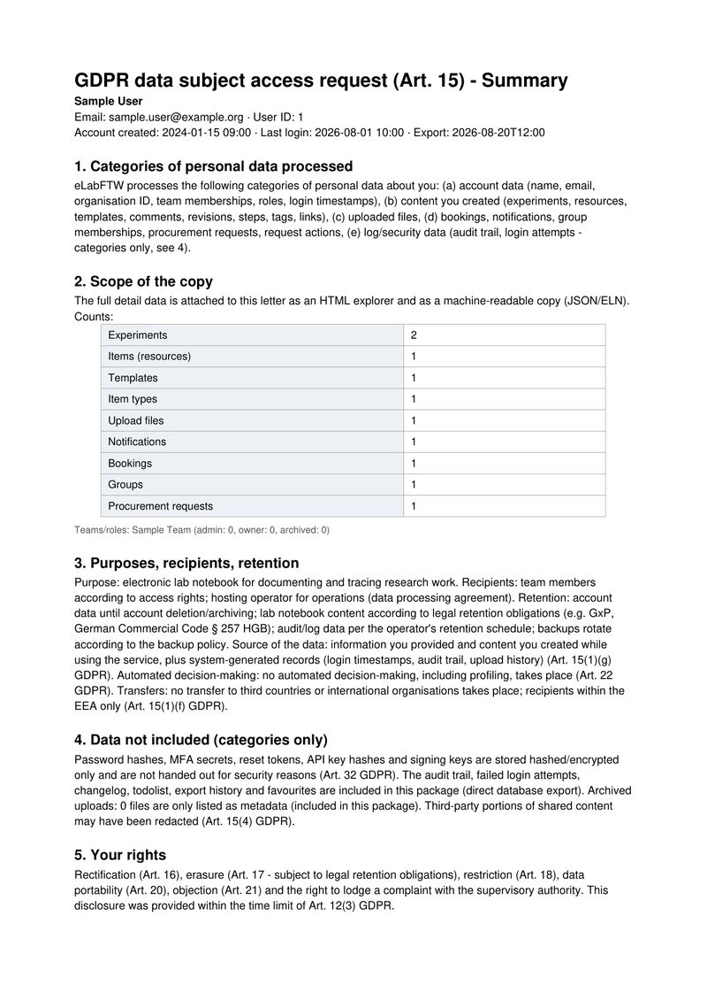
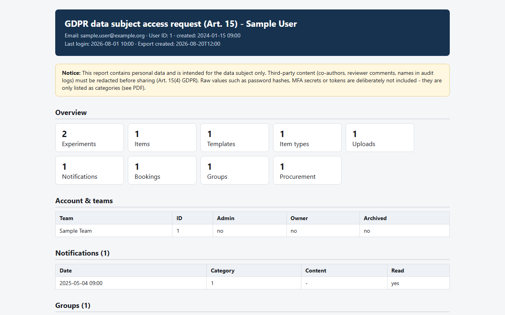

# eLabFTW GDPR Tool _(elabftw-gdpr)_

Answer GDPR data subject access requests (Art. 15) for [eLabFTW](https://www.elabftw.net/) with one command.

Two pipelines, one goal: a complete, auditable disclosure.

- **DB pipeline** (`elab-gdpr-db`): no API key needed. Reads everything directly from MySQL (including archived uploads, the audit trail, failed logins) and copies upload files from the docker volume. Use this for the actual disclosure.
- **API pipeline** (`elab-gdpr`): needs a sysadmin API key. Fast, good for a quick check, but not complete on its own (see [Usage](#usage)).

## Sample report

What you get for every request - fully synthetic data, click to open the real files:

<p align="center">
  <a href="sample/SAMPLE-DISCLOSURE.pdf">
    
  </a>
  <br>
  <a href="sample/SAMPLE-DISCLOSURE.pdf">Open the full letter (PDF)</a>
</p>

<p align="center">
  <a href="https://harrytyp.github.io/elabftw-gdpr/sample/sample-report/User1/index.html">
    
  </a>
  <br>
  <a href="https://harrytyp.github.io/elabftw-gdpr/sample/sample-report/User1/index.html">Open the interactive HTML explorer</a>
</p>

Every request produces three files in `output/User<id>/`:

- `index.html` - the disclosure explorer you read in a browser: user profile, all entries (experiments, items, templates), comments, steps, uploads, and every appendix section (audit trail, failed logins, changelog, API keys, exports, storage, compounds, notifications, entity links, third-party comments, name mentions)
- `Disclosure_User<id>.pdf` - the official Art. 15 disclosure letter (one page, ready to send after redaction)
- `gdpr_disclosure_User<id>.zip` - everything as a package

## Install and where to run it

The tool is a Python CLI. Where you run it depends on the pipeline:

| Pipeline | Where to run | Requirements |
|---|---|---|
| **API** (`elab-gdpr`) | Any machine with Python 3.10+ (your laptop, a VM, anywhere with network access to eLabFTW) | eLabFTW URL + sysadmin API key |
| **DB** (`elab-gdpr-db`) | **On the eLabFTW server itself**, in the host shell (not inside the MySQL container, not in the web UI) | Shell access to the server + `docker` (it auto-detects the MySQL container) |

```bash
# Install (default branch = latest code):
pip install git+https://github.com/harrytyp/elabftw-gdpr
```

Then use the commands below. No installation is needed on the eLabFTW server:
clone the repo there and run `./gdpr_db_full.sh` (see [Usage](#usage)).

## Usage

Both pipelines share the same options. `--users 75,82` selects users
(comma-separated IDs; interactive pick if omitted), `--with-files` downloads
file contents (default: metadata only), `--dry-run` counts without writing,
`--out-dir <path>` sets the output location.

### API pipeline - quick check, needs a sysadmin API key

```bash
elab-gdpr users                     # find the user ID
elab-gdpr --users 42                # export + report (1 click)
elab-gdpr --users 42 --with-files   # also download file contents
```

First run asks for the instance URL and the API key once (stored in
`elabftw.env`, chmod 600, gitignored). The API package contains a red banner
and `LIMITATIONS.md` listing what is missing.

### DB pipeline - complete disclosure, no API key

```bash
# One-time setup on the eLabFTW server (host shell):
git clone https://github.com/harrytyp/elabftw-gdpr && cd elabftw-gdpr
python3 -m venv .venv && .venv/bin/pip install -r requirements.txt

# Per request (1 click):
./gdpr_db_full.sh --users 42 --with-files
```

It auto-detects the MySQL container, the compose `.env` and the database
name; if several candidates exist it asks (recursive). Override with
`--db-container <name>`, `--db-env-file <path>`, `--db-name <name>`.

### What each pipeline covers

| Data | API | DB |
|---|---|---|
| Account data, teams, entities (experiments, items, templates, item types) with comments, revisions, steps, tags | yes | yes |
| Upload metadata; file contents with `--with-files` | yes | yes |
| Upload binaries, incl. archived (state=2) | no | yes |
| Audit trail, failed logins, changelog, API keys, exports, todolist, sig keys, favorites, pins, team groups | no | yes |
| Storage history + assignments, compounds + links, template/type steps, signatures, request actions, procurement, notifications, entity links | no | yes |
| Third-party comments on the user's entries (data about the person from other people's content; redact before sending) | no | yes |

## Before sending the disclosure

1. **Redact third-party data (Art. 15(4)):** audit trail bodies, changelog
   content and shared documents may contain other people's names
   (co-authors, reviewers). Manually black them out.
2. **Never hand out:** password hashes, MFA secrets, reset tokens, API key
   hashes, signing private keys. These are only listed as categories in the
   PDF, by design.
3. **Deadline:** 1 month (Art. 12(3) GDPR), +2 months for complex cases.
4. **This tool is not legal proof.** It assembles data, not legal advice.
   Have a GDPR officer or DPO review the disclosure before sending it.

## Security

- The API key is stored in `elabftw.env` (chmod 600, gitignored); `config
  show` never prints it.
- Never commit or share `elabftw.env`, `output/` (contains personal data) or
  any export package.
- The DB pipeline reads the MySQL password from the compose `.env` on the
  server and never stores or logs it.
- Run log: `output/gdpr.log` (accountability, Art. 5(2)).

## Project layout

```
elabftw-gdpr/
├── gdpr.py                  <- CLI, API pipeline (installed as `elab-gdpr`)
├── gdpr_db_full.py          <- CLI, DB pipeline (installed as `elab-gdpr-db`)
├── gdpr_db_full.sh          <- 1-click server wrapper (DB pipeline)
├── gdpr.bat                 <- Windows wrapper (API pipeline)
├── scripts/                 <- internal modules (not run directly)
│   ├── gdpr_export.py       <- API export
│   ├── gdpr_report.py       <- report (HTML + PDF + ZIP)
│   ├── gdpr_detect.py       <- autodetect MySQL container / compose / DB
│   ├── gdpr_cli.sql         <- DB queries for API gaps
│   └── db-inventory.sql     <- complete DB schema reference
├── tests/                   <- test data seeding (see README-testing.md)
├── sample/                  <- sample report (builder, letter, previews)
│   └── previews/            <- embedded preview images (used in README)
├── pyproject.toml, requirements.txt, LICENSE
```

`output/`, `.venv/`, `dist/` and `elabftw.env` are local (gitignored).

## Maintainers

- [@harrytyp](https://github.com/harrytyp), maintainer

## Contributing

Questions, bugs and ideas: [GitHub issues](https://github.com/harrytyp/elabftw-gdpr/issues).

Pull requests are welcome. For anything touching the export format or the
GDPR text, please open an issue first to discuss. This tool produces legal
documents and changes to the disclosure content should be deliberate.

## License

[MIT](LICENSE) © harrytyp
